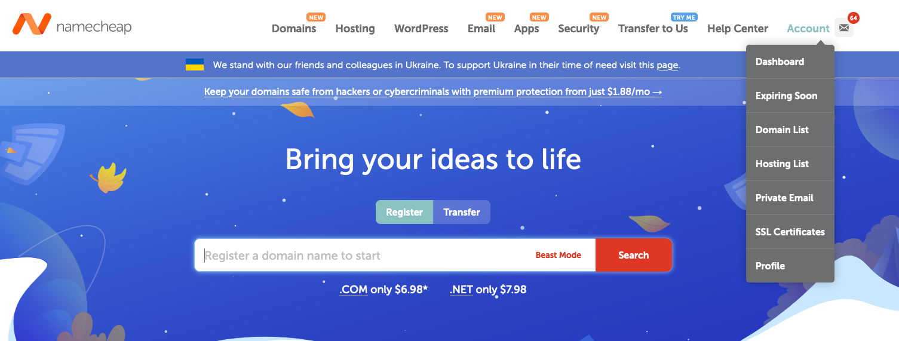

# Use Custom Domain Names

As you probably notice, the URI from your Akash deployment is a crazy string of characters. There's nothing wrong with this, but it'd be difficult to remember, advertise, or brand off of. For example, normal Internet Protocol addresses are numbers. If you type http://8.8.8.8 into your browser, you should reach https://dns.google. Their config info is as follows:

```
{
  "Status": 0 /* NOERROR */,
  "TC": false,
  "RD": true,
  "RA": true,
  "AD": false,
  "CD": false,
  "Question": [
    {
      "name": "8.8.8.8.in-addr.arpa.",
      "type": 12 /* PTR */
    }
  ],
  "Answer": [
    {
      "name": "8.8.8.8.in-addr.arpa.",
      "type": 12 /* PTR */,
      "TTL": 21180,
      "data": "dns.google."
    }
  ]
}
```

While 8.8.8.8 might not be too hard to remember, if you had to remember 100 websites, all with different numbers, it would become a problem. The introduction of [Ipv6](https://www.tutorialspoint.com/ipv6/ipv6\_address\_types.htm) would make this task nearly impossible (example: 2001:0000:3238:DFE1:63:0000:0000:FEFB). This is why we use domain names, like google.com. Domain names allow us to access the internet in human readable ways.

So, let's add a domain name to our Akash site. To do this, we'll buy a domain name from NameCheap.

**Purchase a Domain Name and Use it in Akash Deployment**

1. Navigate to [namecheap.com](https://www.namecheap.com/) and sign up for an account
2. Search for a Domain Name
3. Add to Cart
4. Purchase Domain Name
5. Once you've purchased a domain name, from the homepage, hover over account and select "Dashboard"

<figure><figcaption></figcaption></figure>

&#x20;   6\.  Scroll down to your domain name and click "Manage"

<figure><figcaption></figcaption></figure>

7\. Click "Advanced DNS", then delete all the current records, and add two new URL Redirect          Records. The host sections should be @ and www. The Value section should be your Akash URI with the http:// prefix added. Make sure to change the "Unmasked" to "Masked".&#x20;

<figure><figcaption></figcaption></figure>

8\. And there you go!

<figure><figcaption></figcaption></figure>


