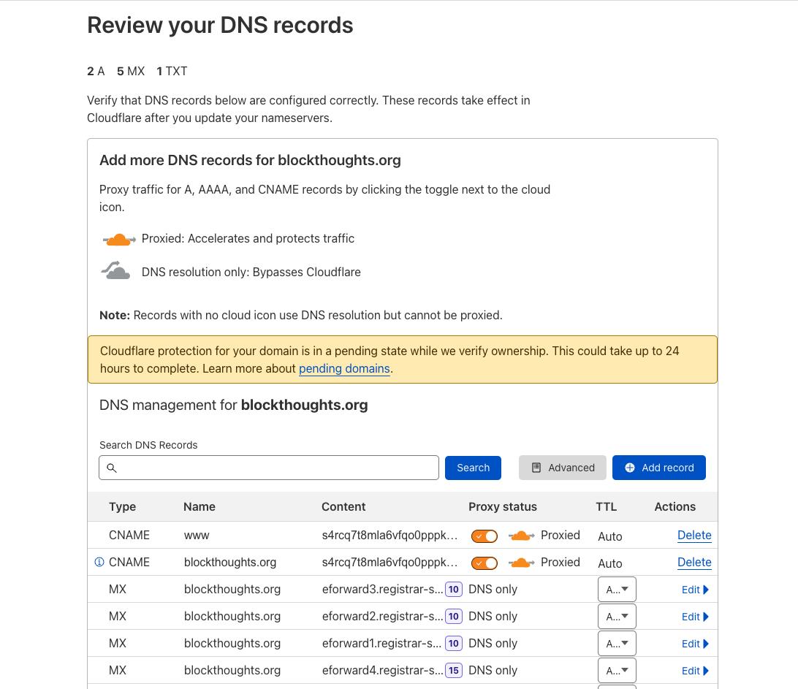
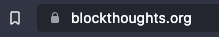

# Use HTTPS

Even with your custom domain name, you'll notice that there is no padlock in the URL bar, indicating that the site is insecure. This is because all we did is tell our domain name to point to the Akash deployment. In other words, this is still an http link, and the connection is still not encrypted. Since our website is a static page, this is insignificant. If you want a production grade, or dynamic application, Secure Socket Layer (SSL) certificates/Transportation Layer Security (TLS) are a must. Let's get that setup now so you can use https.

Currently Akash does not have native support for port [443/8443](https://www.lifewire.com/what-is-port-443-4690657), which are the web server ports for encrypted communication between the server and client. Effectively, we won't be able to enter 443 in our manifest, but will have to proxy the connection with an entity that supports SSL certificates and encrypted server communications. For this walkthrough, we'll use Cloudflare as our proxy.

**Secure Your Akash Site With HTTPS**

1. Navigate to cloudflare.com and make an account
2.  On the homepage, click "Add a site"

    <figure><figcaption></figcaption></figure>
3.  Add your namecheap domain to cloudflare. Click "Add site".

    <figure><figcaption></figcaption></figure>
4.  Select the free plan option and then click "Continue".

    <figure><figcaption></figcaption></figure>
5.  Delete any A/AAAA/CNAME records and replace them with two new CNAME records. Do this by clicking "Add record", selecting "CNAME", enter @ and www as the respective names (@ will auto result to the domain name), and then enter the Akash URI as the target (this time with **no** http:// prefix). Click "Continue" at the bottom of the page.

    <figure><figcaption></figcaption></figure>
6.  Copy Cloudflare's nameservers (number 3 on picture).

    <figure><figcaption></figcaption></figure>
7.  Go back to the manage page on namecheap.com for your domain name, click "Domain", scroll down to the "Nameservers" section, select "Custom DNS", and enter in Cloudflare's nameservers from step 6.

    <figure><figcaption></figcaption></figure>
8. Go back to Cloudflare and select "Done, check nameservers".
9.  Select "Finish later".

    <figure><figcaption></figcaption></figure>
10. Select "Check nameservers" at the bottom of the page. This can take up to 48 hours, but is usually done within a few hours.

    <figure><figcaption></figcaption></figure>
11. Click "SSL/TLS" on the left side of the screen, then "Overview" and select "Full".

    <figure><figcaption></figcaption></figure>
12. Select "Edge Certificates" under "SSL/TLS" and turn on "Always Use HTTPS".

    <figure><figcaption></figcaption></figure>
13. Go back to the Cloudmos Deploy tool and click on your deployment from the "Dashboard" section. Click on the "Update tab".

    <figure><figcaption></figcaption></figure>
14. A a new "accept" section and add your domain name and the www prefixed domain name. The accept section can go before or after the "to" section.

    <figure><figcaption></figcaption></figure>
15. Click "Update Deployment" and pay the fee.
16. Select "Leases". You should see your domain names now. Click on one of the domain names.

    <figure><figcaption></figcaption></figure>
17. You should now see your website and the padlock present in the URL bar. All done!

    <figure><figcaption></figcaption></figure>

