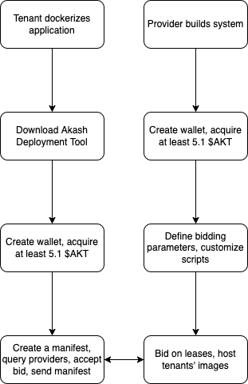

# How does Akash work?

Akash principally serves as a platform where providers bid on prospective deployments; Akash Network calls this the [Deployment Marketplace](https://docs.akash.network/):

```
The Akash Marketplace is where users lease computing resources from Cloud providers 
before deploying a Docker container on the Akash Container Platform. The marketplace
stores on-chain records of requests, bids, leases, and settlement payments using the 
Akash Token (AKT). Akash's blockchain is a Tendermint based application based on the 
Cosmos SDK.
```

First, a tenant builds a [docker image](https://hub.docker.com/) (bundle of code) they want hosted on a provider. Then they query providers willing to host this image. Providers bid against each other to host these images at prices set by the tenant. If an acceptable arrangement is made, the provider takes the Akash lease and deploys it via Kubernetes pods. A Uniform Resource Identifier (URI) is returned to the tenant who can now access their instantiated image.

A basic flow chart visualizes this process. The left side is the flow from the perspective of the tenant (deployer) and the right side is from the perspective of the provider:




This is the broad stroke explanation of Akash. We are skipping over major concepts such as how blockchains operate, how Akash was built, how Kubernetes works, etc. This is because these guides are intended to enable _anyone_ to become an auditor on Akash and, similar to how you can productively use a computer without understanding how machine code works, or drive a car without being an engineer, you can use Akash without being a coding expert/computer scientist.

What is most important is actually using the product firsthand to understand the experience and utility of the platform. With hands on experience, you'll see how you can provide positive value base-level audits. Always keep in mind that these guides sacrifice performance, completeness, and sovereignty for usability and simplicity. Make changes where you see fit!

&#x20;
